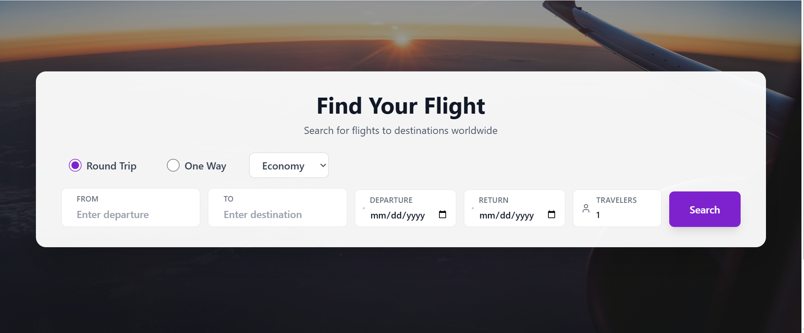
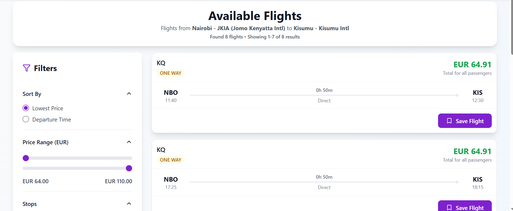
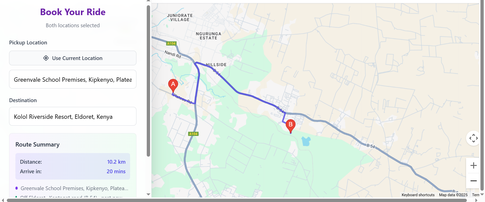
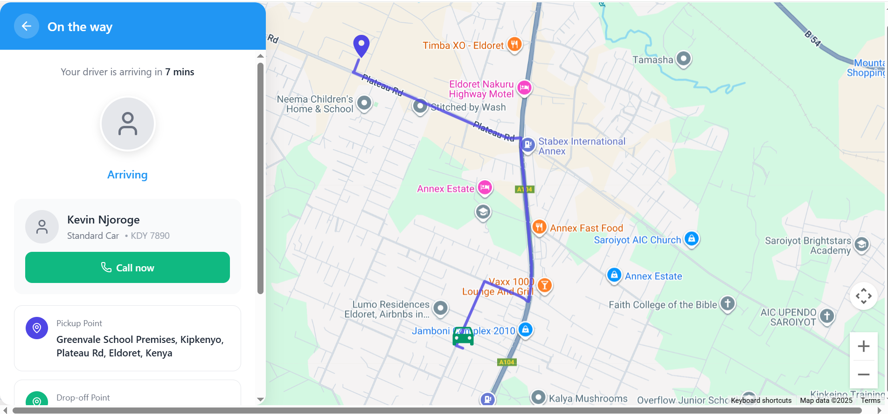
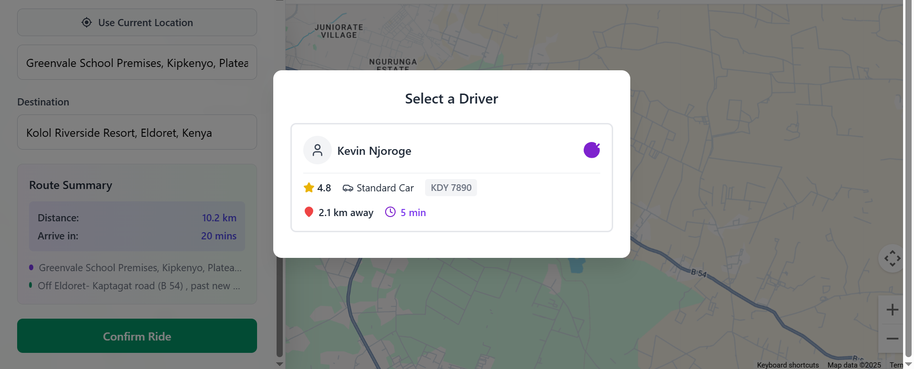
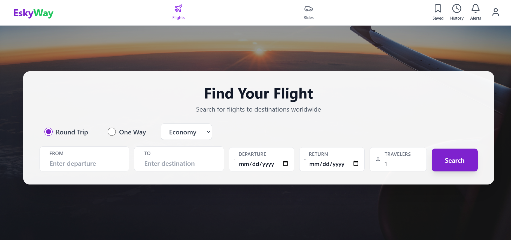

# ESKYWAY ✈️🚗

<div align="center">


**A modern flight and ride booking platform**

[](https://reactjs.org/)
[](https://vitejs.dev/)
[](https://firebase.google.com/)
[](https://tailwindcss.com/)
[](https://opensource.org/licenses/MIT)

[Features](#-features) • [Demo](#-screenshots) • [Installation](#-installation) • [Documentation](#-documentation) • [Contributing](#-contributing)

</div>

---

## 🚀 Live Demo

**Production:** [https://eskyway.vercel.app](https://eskyway-web-app.vercel.app/)

**Backend API:** [https://eskyway-api.onrender.com](https://eskyway-web-app.onrender.com)

*Note: First load may take 30-60 seconds as Render free tier spins up the backend.*

---

## 🎥 Demo Video
[Watch the demo](/public/video/Eskyway%20-%20Google%20Chrome%202025-11-28%2005-35-38.mp4)

---

## 📋 Table of Contents

- [Overview](#-overview)
- [Features](#-features)
- [Screenshots](#-screenshots)
- [Tech Stack](#-tech-stack)
- [Prerequisites](#-prerequisites)
- [Installation](#-installation)
- [Configuration](#-configuration)
- [Project Structure](#-project-structure)
- [Usage](#-usage)
- [Ride Booking Flow](#-ride-booking-flow)
- [Testing Guidelines](#-testing-guidelines)
- [API Reference](#-api-reference)
- [Troubleshooting](#-troubleshooting)
- [Contributing](#-contributing)
- [License](#-license)
- [Contact](#-contact)

---

## 🌟 Overview

**ESKYWAY** is a full-stack platform that seamlessly integrates flight search and comparison with ride-hailing services. Built with React and powered by Firebase, it provides users with a unified experience for planning their entire journey—from finding flights to arranging ground transportation.

### Key Highlights

- 🔍 **Smart Flight Search** - Real-time flight data with advanced filtering
- 🚗 **Live Ride Tracking** - Real-time driver location updates via Google Maps
- 🔐 **Secure Authentication** - Firebase-powered user management
- 📱 **Responsive Design** - Optimized for desktop, tablet, and mobile
- ⚡ **Lightning Fast** - Built on Vite for optimal performance
- 🔔 **Real-time Notifications** - Instant updates on ride status and bookings

### Shared Backend (Web + Android)
- The ESKYWAY web app and Android driver app use the same Firebase backend (Firestore / Realtime Database).  
  This enables real-time synchronization of driver locations, ride status, and matching data so drivers and passengers connect faster and see the same state across both platforms.
- Important: Drivers are present only on the Android driver app — there is no driver interface in the web app. The web app is intended for passengers (and admin) while driver operations run from the Android app.
- Why Firebase (not MongoDB): Firebase was chosen because the web and Android apps require a shared, realtime backend with built-in auth, offline support, and low-latency synchronization (Firestore / Realtime Database). Using Firebase avoids building and hosting a custom realtime layer (websockets, sync logic, auth integration) that would be required with MongoDB, making it faster to integrate drivers and passengers across platforms.

### Sustainability & Impact
- 🌍 **Contributing to UN SDG 11** - Sustainable Cities and Communities
- ♻️ **Eco-Friendly Solutions** - Efficient route planning and shared mobility
- 📱 **Digital Accessibility** - Removing barriers to transportation services

---

## 🌍 Sustainable Development Goals

ESKYWAY is committed to supporting the United Nations Sustainable Development Goals (SDGs), particularly **SDG 11: Sustainable Cities and Communities**.

### Primary Focus: SDG 11 - Sustainable Cities and Communities

<div align="center">
  
</div>

#### How ESKYWAY Contributes:

**1. 🚗 Sustainable Transportation**
- Flight search system promotes efficient air travel planning
- Ride tracking features encourage shared mobility solutions
- Optimized routing reduces unnecessary travel

**2. 🏙️ Urban Mobility**
- Real-time tracking minimizes passenger wait times
- Integrated transport options (flights and ground transportation)
- Digital solutions for better urban transportation management
- Seamless journey planning from air to ground

**3. ♿ Accessibility**
- User-friendly interface makes transportation services accessible to all
- Digital booking system removes traditional barriers to access
- Mobile-responsive design for access anywhere, anytime
- No physical infrastructure required for booking

### Secondary SDGs Addressed:

#### SDG 9: Industry, Innovation and Infrastructure
<div align="center">
  
</div>

- **Digital Infrastructure:** Cloud-based platform for transportation services
- **Innovation in Mobility:** Real-time tracking and driver-passenger matching
- **Technology Access:** Democratizing access to modern transportation solutions

#### SDG 13: Climate Action
<div align="center">
  
</div>

- **Emission Reduction:** Efficient route planning minimizes fuel consumption
- **Digital Solutions:** Paperless booking and tracking reduces waste
- **Smart Mobility:** Data-driven decisions for optimal transportation choices

### Our Commitment

The app's focus on **integrated transportation solutions** and **digital accessibility** aligns directly with the UN's vision for creating more **sustainable, inclusive, and resilient cities**. By connecting flight search with ground transportation, ESKYWAY helps users make informed decisions that benefit both their journey and the environment.

---

## ✨ Features

### Flight Search & Comparison
- ✈️ Search flights by origin, destination, and dates
- 🎯 Advanced filters (travel class, passengers, layovers)
- 💾 Save favorite flights for quick access
- 🔗 Direct airline links for external booking
- 📊 Price comparison across multiple airlines

### Ride Hailing
- 📍 Smart pickup and destination selection
- 🚕 Multiple vehicle categories (Standard, Luxury, XL)
- 💰 Real-time fare estimation
- 🗺️ Live driver tracking on interactive map
- 📜 Complete ride history
- ⭐ Driver rating system

### User Experience
- 🔔 Toast notifications for instant feedback
- 👤 User profile management
- 📱 Responsive navigation
- 🌙 Clean, modern UI
- ⚡ Fast page loads and smooth transitions

---

## 📸 Screenshots

### Flight Search Page
<div align="center">
  
  <p><em>Clean and intuitive flight search interface with date and passenger selection</em></p>
</div>

### Flight Results & Filtering
<div align="center">
  
  <p><em>Comprehensive flight results with advanced filters and price comparison</em></p>
</div>

### Ride Booking Interface
<div align="center">
  
  <p><em>Intuitive ride booking with pickup and destination selection</em></p>
</div>

### Live Tracking
<div align="center">
  
  <p><em>Real-time driver tracking with route visualization</em></p>
</div>

### Driver Selection
<div align="center">
  
  <p><em>Choose from available drivers with ratings and vehicle details</em></p>
</div>

### User Dashboard
<div align="center">
  
  <p><em>Manage saved flights, ride history, and profile settings</em></p>
</div>

> **Note:** To add screenshots, create a `docs/screenshots` folder and place your images there. Update the paths accordingly.

---

## 🛠️ Tech Stack

### Frontend
- **Framework:** React 18.x
- **Build Tool:** Vite 5.x
- **Styling:** Tailwind CSS 3.x
- **Routing:** React Router v6
- **State Management:** React Context API

### Backend & Services
- **Authentication:** Firebase Auth
- **Database:** Cloud Firestore
- **Real-time Updates:** Firebase Realtime Database
- **Maps Integration:** Google Maps JavaScript API
- **Hosting:** Firebase Hosting (production)

### Development Tools
- **Package Manager:** npm/yarn
- **Code Formatting:** Prettier
- **Linting:** ESLint
- **Version Control:** Git

---

## 📦 Prerequisites

Before you begin, ensure you have the following installed:

- **Node.js** (v18.x or higher) - [Download](https://nodejs.org/)
- **npm** (v9.x or higher) or **yarn** (v1.22.x or higher)
- **Git** - [Download](https://git-scm.com/)

### Required Accounts
- [Firebase Account](https://firebase.google.com/) (free tier works)
- [Google Cloud Platform Account](https://cloud.google.com/) (for Maps API)

---

## 🚀 Installation

### 1. Clone the Repository

```bash
git clone https://github.com/Goofy-collab/Eskyway-web-app.git
cd Eskyway-web-app
```

### 2. Install Dependencies

```bash
npm install
```

Or using yarn:

```bash
yarn install
```

### 3. Set Up Environment Variables

Create a `.env` file in the project root:

```bash
cp .env.example .env
```

Edit `.env` with your credentials:

```env
# Firebase Configuration
VITE_FIREBASE_API_KEY=your_firebase_api_key
VITE_FIREBASE_AUTH_DOMAIN=your_project.firebaseapp.com
VITE_FIREBASE_PROJECT_ID=your_project_id
VITE_FIREBASE_STORAGE_BUCKET=your_project.appspot.com
VITE_FIREBASE_MESSAGING_SENDER_ID=your_sender_id
VITE_FIREBASE_APP_ID=your_app_id

# Google Maps API
VITE_GOOGLE_MAPS_API_KEY=your_google_maps_api_key

# Optional: Flight API
VITE_FLIGHT_API_KEY=your_flight_api_key
```

> ⚠️ **Important:** Never commit your `.env` file. It's already included in `.gitignore`.

### 4. Firebase Setup

1. Go to [Firebase Console](https://console.firebase.google.com/)
2. Create a new project or select existing one
3. Enable the following services:
   - **Authentication** (Email/Password provider)
   - **Cloud Firestore** (Start in production mode)
   - **Realtime Database** (for live driver locations)
4. Copy your Firebase config to `.env`

### 5. Google Maps Setup

1. Go to [Google Cloud Console](https://console.cloud.google.com/)
2. Enable the following APIs:
   - Maps JavaScript API
   - Directions API
   - Places API
3. Create an API key and add it to `.env`
4. Set up API key restrictions for security

### 6. Run the Development Server

```bash
npm run dev
```

The app will be available at `http://localhost:5173`

### 7. Build for Production

```bash
npm run build
npm run preview
```

---

### Tailwind Configuration

Customize theme in `tailwind.config.js`:

```javascript
export default {
  content: ['./index.html', './src/**/*.{js,jsx}'],
  theme: {
    extend: {
      colors: {
        primary: '#3B82F6',
        secondary: '#10B981',
      },
    },
  },
  plugins: [],
};
```

---

## 📁 Project Structure

```
eskyway/
├── public/
│   └── images/              # Static images (flight thumbnails, etc.)
│       ├── flight1.jpg
│       └── ...
├── src/
│   ├── assets/              # React assets (icons, logos)
│   ├── components/          # Reusable UI components
│   │   ├── FlightCard.jsx
│   │   ├── FlightFilters.jsx
│   │   ├── FlightResults.jsx
│   │   ├── FlightSearchForm.jsx
│   │   ├── LoadingIndicator.jsx
│   │   ├── LocationInput.jsx
│   │   ├── Navigation.jsx
│   │   ├── NotificationDropdown.jsx
│   │   ├── SavedFlightsDropdown.jsx
│   │   └── Toast.jsx
│   ├── data/                # Static data files
│   │   └── locations.js
│   ├── services/            # API and business logic
│   │   └── flightService.js
│   ├── App.jsx              # Main app component
│   ├── App.css              # Global styles
│   ├── AuthContext.jsx      # Authentication context
│   ├── AuthScreen.jsx       # Login/Signup page
│   ├── firebase.js          # Firebase configuration
│   ├── FlightBooking.jsx    # Flight booking page
│   ├── RideCompletionListener.jsx
│   ├── RideHistoryDropdown.jsx
│   ├── RideInputForm.jsx    # Ride booking form
│   ├── TrackingScreen.jsx   # Live ride tracking
│   ├── main.jsx             # App entry point
│   └── index.css            # Tailwind imports
├── backend/                 # Optional Node.js server
│   ├── server.js
│   └── package.json
├── docs/                    # Documentation and screenshots
│   └── screenshots/
├── .env                     # Environment variables (not committed)
├── .env.example             # Environment template
├── .gitignore
├── index.html               # HTML entry point
├── package.json
├── postcss.config.js
├── tailwind.config.js
├── vite.config.js
└── README.md
```

### Key Files Explained

| File/Folder | Purpose |
|-------------|---------|
| `src/components/` | Reusable React components (buttons, cards, forms) |
| `src/services/` | API calls and business logic abstraction |
| `src/firebase.js` | Firebase initialization and configuration |
| `src/AuthContext.jsx` | Global authentication state management |
| `src/TrackingScreen.jsx` | Real-time map tracking interface |
| `backend/` | Optional Express server for API proxy |
| `public/images/` | Static assets served directly |
| `.env` | Sensitive configuration (never commit) |

---

## 🎯 Usage

### Starting the Application

```bash
# Development mode with hot reload
npm run dev

# Production build
npm run build

# Preview production build
npm run preview
```

### Basic User Flow

1. **Sign Up / Login**
   - Navigate to authentication page
   - Create account or login with existing credentials

2. **Search Flights**
   - Enter origin and destination
   - Select dates and passenger count
   - Apply filters (class, stops, airlines)
   - Compare prices across airlines
   - Save favorite flights for later
   - Click airline links to complete booking on airline website

3. **Book a Ride**
   - Click "Rides" in navigation
   - Enter pickup location
   - Enter destination
   - Select vehicle type (Standard, Premium , Van)
   - Choose from available drivers
   - Track ride in real-time

4. **Manage Account**
   - View ride history
   - Check saved flights
   - Get Notifications from the driver
   - Logout securely

---

## 🧪 Testing Guidelines

### Important Testing Notes

> ⚠️ **CRITICAL:** When testing the ride booking feature, always select **Standard** as the vehicle type.

**Why?** All active test drivers are currently registered under the `Standard` category. Selecting other categories (Luxury, XL, etc.) will result in no available drivers.

### Testing Checklist

- [ ] User registration and login
- [ ] Flight search with various filters
- [ ] Saving and removing favorite flights
- [ ] Ride request creation (Standard vehicle only)
- [ ] Driver selection from available drivers
- [ ] Real-time map tracking
- [ ] Ride completion flow
- [ ] Notifications and toast messages
- [ ] Logout and session management

### Running Tests

```bash
# Unit tests (if configured)
npm run test

# End-to-end tests (if configured)
npm run test:e2e
```

---

## 📚 API Reference

### Flight Service

```javascript
// Search flights
import { searchFlights } from './services/flightService';

const results = await searchFlights({
  origin: 'NBO',
  destination: 'JFK',
  departDate: '2025-12-01',
  returnDate: '2025-12-15',
  passengers: 2,
  class: 'economy'
});
```

### Firebase Methods

```javascript
// Create ride request
import { collection, addDoc } from 'firebase/firestore';
import { db } from './firebase';

const rideRef = await addDoc(collection(db, 'rides'), {
  userId: auth.currentUser.uid,
  pickup: { lat: -1.286389, lng: 36.817223 },
  destination: { lat: -1.292066, lng: 36.821945 },
  vehicleType: 'Standard',
  status: 'pending',
  timestamp: new Date()
});
```

---

## 🔧 Troubleshooting

### Common Issues and Solutions

| Issue | Solution |
|-------|----------|
| **Import errors** | Check file paths are relative to current file. Use `../` to go up directories. |
| **Firebase not loading** | Verify `.env` variables start with `VITE_` prefix |
| **Google Maps blank** | Ensure Maps API key is valid and APIs are enabled in Google Cloud Console |
| **Images not loading** | Place images in `/public/images` and reference as `/images/filename.jpg` |
| **Build errors** | Delete `node_modules` and `package-lock.json`, then run `npm install` again |
| **Hot reload not working** | Restart dev server with `npm run dev` |

### Checking Firebase Connection

```bash
# Verify firebase.js exists
dir src\firebase.js

# Test environment variables
node -e "console.log(process.env)"
```

### Debug Mode

Enable debug logging in your browser console:

```javascript
localStorage.setItem('debug', 'eskyway:*');
```

### Getting Help

If you encounter issues:

1. Check [Troubleshooting](#-troubleshooting) section
2. Search [existing issues](https://github.com/yourusername/eskyway/issues)
3. Create a [new issue](https://github.com/yourusername/eskyway/issues/new) with:
   - Error message
   - Steps to reproduce
   - Browser and OS version
   - Screenshots if applicable

---

## 🤝 Contributing

We welcome contributions! Here's how you can help:

### Getting Started

1. **Fork the repository**
   ```bash
   # Click "Fork" button on GitHub
   ```

2. **Clone your fork**
   ```bash
   git clone https://github.com/your-username/eskyway.git
   cd eskyway
   ```

3. **Create a feature branch**
   ```bash
   git checkout -b feature/amazing-feature
   ```

4. **Make your changes**
   - Write clean, documented code
   - Follow existing code style
   - Add comments for complex logic

5. **Format your code**
   ```bash
   # Using Prettier (recommended)
   npm run format
   # Or in VS Code: Alt + Shift + F
   ```

6. **Commit your changes**
   ```bash
   git commit -m "Add amazing feature"
   ```

7. **Push to your fork**
   ```bash
   git push origin feature/amazing-feature
   ```

8. **Create a Pull Request**
   - Go to original repository
   - Click "New Pull Request"
   - Select your branch
   - Describe your changes

### Contribution Guidelines

- ✅ Keep commits small and focused
- ✅ Write meaningful commit messages
- ✅ Update documentation for new features
- ✅ Test your changes thoroughly
- ✅ Follow React best practices
- ✅ Use Tailwind utility classes
- ❌ Don't commit `.env` file
- ❌ Don't include large binary files

### Code Style

- Use functional components with hooks
- Prefer named exports for components
- Use async/await over promises
- Extract reusable logic to custom hooks

### Reporting Bugs

Found a bug? [Open an issue](https://github.com/yourusername/eskyway/issues/new) with:

- **Title:** Clear, descriptive summary
- **Description:** What happened vs. what should happen
- **Steps to reproduce:** 1, 2, 3...
- **Environment:** Browser, OS, Node version
- **Screenshots:** If applicable

---

## 📄 License

This project is licensed under the **MIT License**.

```
MIT License

Copyright (c) 2025 ESKYWAY

Permission is hereby granted, free of charge, to any person obtaining a copy
of this software and associated documentation files (the "Software"), to deal
in the Software without restriction, including without limitation the rights
to use, copy, modify, merge, publish, distribute, sublicense, and/or sell
copies of the Software, and to permit persons to whom the Software is
furnished to do so, subject to the following conditions:

The above copyright notice and this permission notice shall be included in all
copies or substantial portions of the Software.

THE SOFTWARE IS PROVIDED "AS IS", WITHOUT WARRANTY OF ANY KIND, EXPRESS OR
IMPLIED, INCLUDING BUT NOT LIMITED TO THE WARRANTIES OF MERCHANTABILITY,
FITNESS FOR A PARTICULAR PURPOSE AND NONINFRINGEMENT. IN NO EVENT SHALL THE
AUTHORS OR COPYRIGHT HOLDERS BE LIABLE FOR ANY CLAIM, DAMAGES OR OTHER
LIABILITY, WHETHER IN AN ACTION OF CONTRACT, TORT OR OTHERWISE, ARISING FROM,
OUT OF OR IN CONNECTION WITH THE SOFTWARE OR THE USE OR OTHER DEALINGS IN THE
SOFTWARE.
```

See [LICENSE](LICENSE) file for full details.

---

## 🙏 Acknowledgments

Special thanks to:

- [React Team](https://reactjs.org/) for the amazing framework
- [Firebase](https://firebase.google.com/) for backend infrastructure
- [Tailwind CSS](https://tailwindcss.com/) for utility-first styling
- [Google Maps Platform](https://mapsplatform.google.com/) for mapping services
- All contributors who have helped improve this project

---

## 🗺️ Roadmap

### Upcoming Features

- [ ] Multi-language support (i18n)
- [ ] Dark mode toggle
- [ ] Payment gateway integration
- [ ] Push notifications
- [ ] Driver app integration docs
- [ ] Advanced analytics dashboard
- [ ] Social login (Google, Facebook)
- [ ] Ride scheduling
- [ ] Corporate accounts
- [ ] Loyalty rewards program

### Version History

- **v1.0.0** (2025-01) - Initial release
  - Flight search and booking
  - Ride hailing with live tracking
  - User authentication
  - Basic ride history

---

<div align="center">

**Made with ❤️ by the ESKYWAY Team**

⭐ Star us on GitHub — it helps!

[Back to Top](#eskyway-)

</div>


